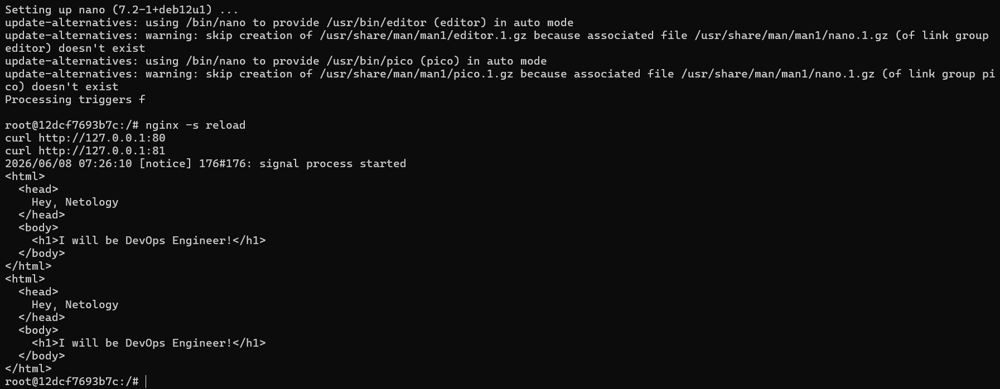
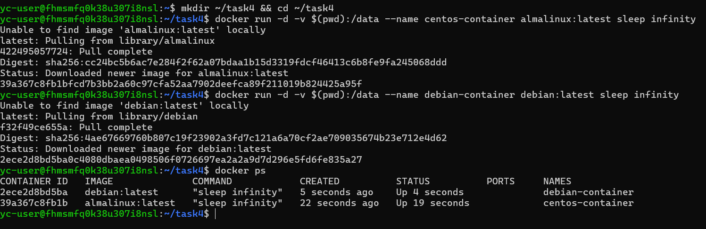
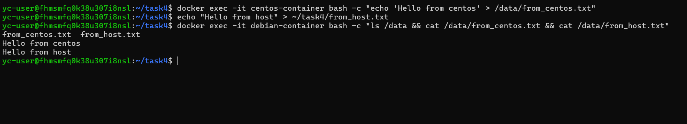
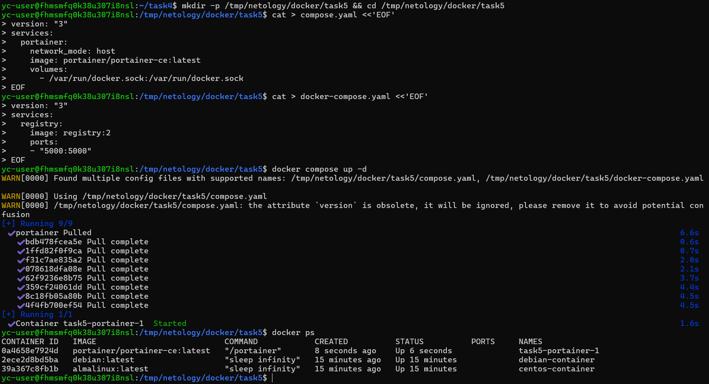
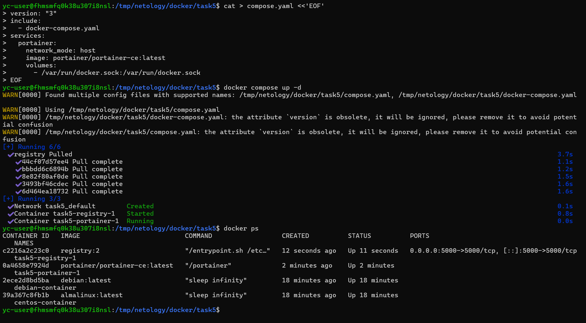
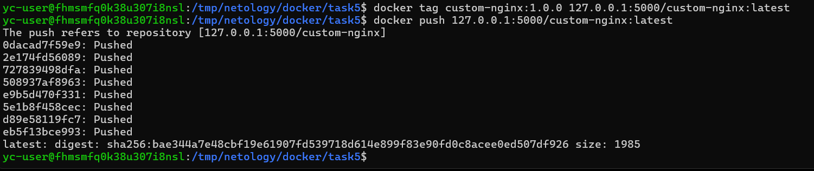
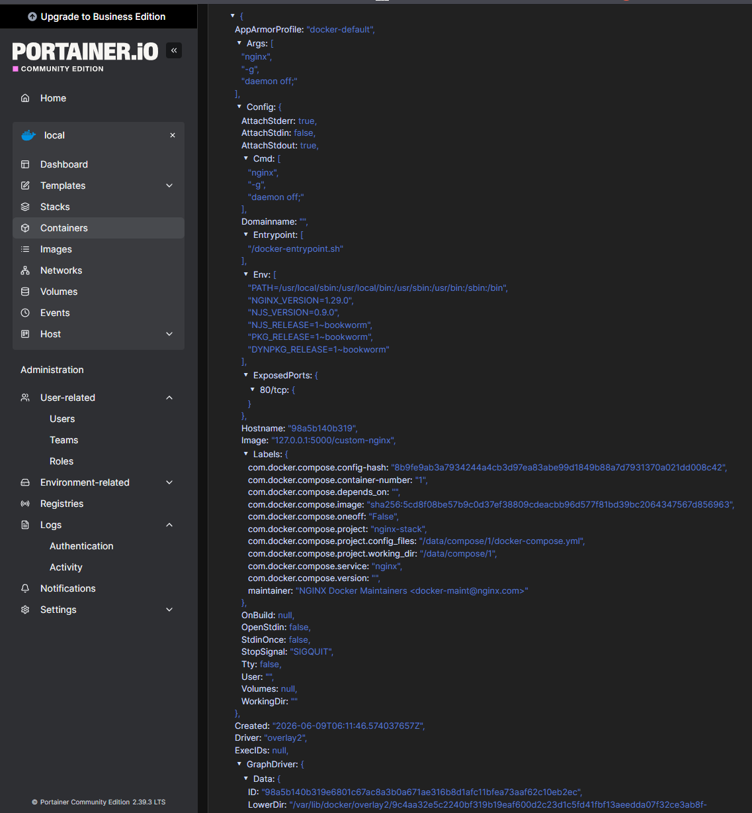

# Домашнее задание к занятию 4 «Оркестрация группой Docker контейнеров на примере Docker Compose»

## Задача 1

**Ссылка на Docker Hub:** https://hub.docker.com/r/zolotkoff/custom-nginx/general


## Задача 2


## Задача 3




**Почему контейнер остановился:**

`docker attach` подключается к основному процессу контейнера (PID 1 — nginx). Ctrl-C отправляет сигнал `SIGINT` этому процессу, nginx завершается, и контейнер останавливается вместе с ним.

```bash
docker ps -a
docker start custom-nginx-t2
docker exec -it custom-nginx-t2 bash
```

Внутри контейнера:
```bash
apt-get update && apt-get install -y nano
nano /etc/nginx/conf.d/default.conf  # заменить listen 80 на listen 81
nginx -s reload
curl http://127.0.0.1:80
curl http://127.0.0.1:81
exit
```

**Проверка снаружи:**
```bash
ss -tlpn | grep 127.0.0.1:8080
docker port custom-nginx-t2
curl http://127.0.0.1:8080
```

**Суть возникшей проблемы:**

При запуске контейнера был проброшен порт `8080 → 80`. После изменения конфига nginx стал слушать порт `81`, а не `80`. Docker проксирует трафик с хостового `8080` на контейнерный `80`, но там уже никто не слушает — отсюда ошибка `Connection reset by peer`. Маппинг портов задаётся при старте контейнера и не меняется на лету.

## Задача 4




## Задача 5




