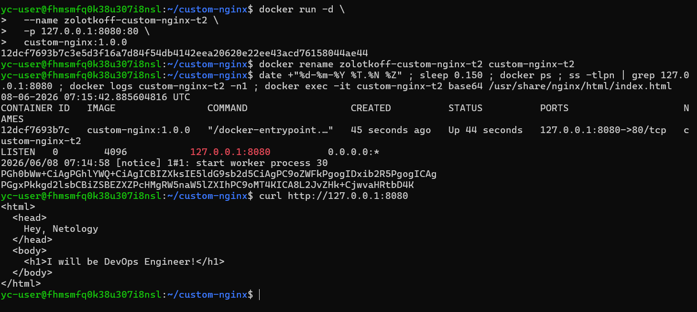
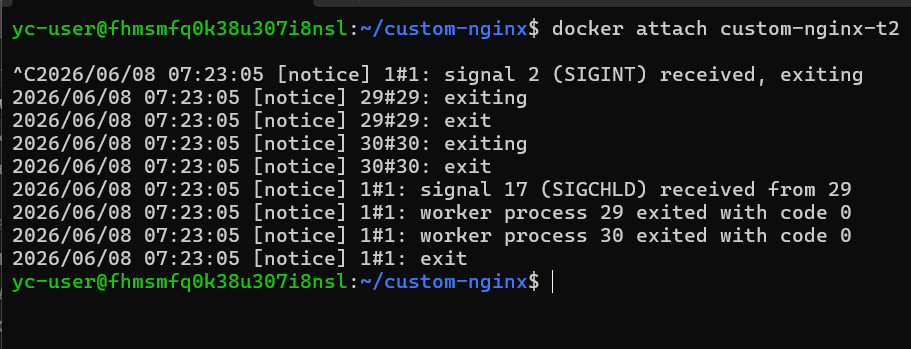

# Домашнее задание к занятию 4 «Оркестрация группой Docker контейнеров на примере Docker Compose»

## Задача 1

**Ссылка на Docker Hub:** https://hub.docker.com/r/zolotkoff/custom-nginx/general

## Задача 2

## Задача 3

